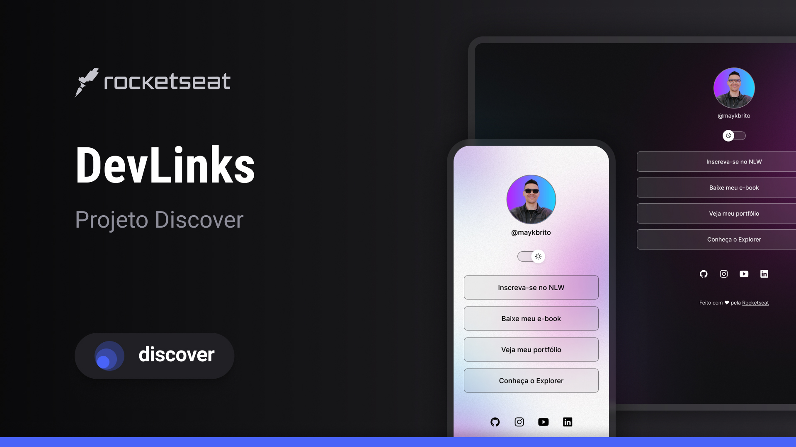

# DevLinks

Programa exclusivo e gratuito, promovido pela Rocketseat para ensino de tecnologias WEB.

[Tecnologias](#-tecnologias) | [Projeto](#-projeto) | [Layout](#-layout) | [Licença](#-licença)

## 🚀 Tecnologias

Esse projeto foi desenvolvido com as seguintes tecnologias:

- HTML e CSS
- JavaScript
- Git e Github
- Figma

## 💻 Projeto

DevLinks é um agregador de links para usar como um cartão de visita online.

## 🔖 Layout

Você pode visualizar o layout do projeto através [DESSE LINK](https://www.figma.com/design/ym7DMLN526Hh3pJPpRYEBY/DevLinks-%E2%80%A2-Projeto-Discover--Community-?node-id=1437-191&t=LhCpVBVoPml8SeIV-0). É necessário ter conta no [Figma](https://figma.com) para acessá-lo.

## 📝 Licença

Este projeto está licenciado sob a licença MIT.
